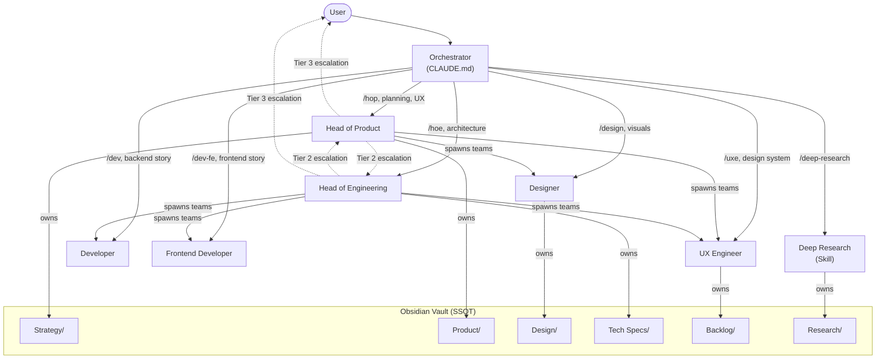
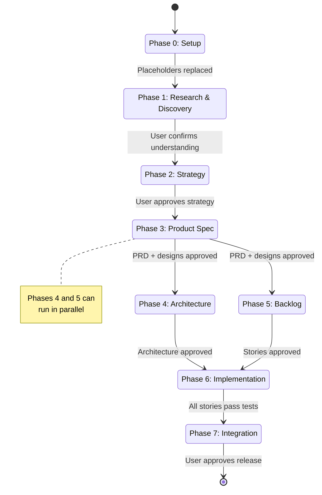

# Claude Code E2E Boilerplate

A reusable multi-agent AI development boilerplate with 6 specialized agents, an Obsidian vault SSOT, 7 MCP servers, agent teams support, and an 8-phase project lifecycle with hard-enforced rules via hooks. Cross-IDE compatible with Claude Code, Cursor, and Google Antigravity.

## Quick Start

1. Clone this repo into your project root
2. Make hooks executable: `chmod +x .claude/hooks/*.sh`
3. Configure MCP servers (see below)
4. Start your IDE and ask it to initialize the workspace — it will walk you through filling in all `{{Project}}` and `{fill in}` placeholders

## IDE Support

This boilerplate ships with native configuration for three AI-powered IDEs:

| IDE | Config Folder | Format | Status |
|-----|---------------|--------|--------|
| **Claude Code** | `.claude/` | Agents (`.md`), Skills (`SKILL.md`), Hooks (`.sh`) | Primary |
| **Cursor** | `.cursor/rules/` | Rules (`.mdc` with YAML frontmatter) | Ported |
| **Google Antigravity** | `.agent/` | Rules (`.md`), Skills (`SKILL.md`), Workflows (`.md`) | Ported |

All three share the same Obsidian vault, protocols, and project lifecycle. The agent definitions and skills are adapted to each IDE's native format.

## What's Included

| Component | Description |
|-----------|-------------|
| `CLAUDE.md` | Orchestrator + Chief of Staff (routes requests, guards SSOT) |
| `AGENTS.md` | Antigravity agent roster and project overview |
| `.claude/agents/` | 6 agents for Claude Code |
| `.claude/skills/` | Skills: Deep Research, Agent Stories, Mermaid Diagrams, Find Skills, Maestro |
| `.claude/protocols/` | Shared protocols: vault-sync, error-logging |
| `.claude/hooks/` | Hard enforcement: phase gating, commit format, vault ownership |
| `.claude/scripts/` | Vault maintenance: rebuild index, audit wikilinks |
| `.cursor/rules/` | Cursor-native rules: agents as personas, skills as rules |
| `.agent/rules/` | Antigravity-native rules and agent personas |
| `.agent/skills/` | Skills in Antigravity format (same SKILL.md structure) |
| `.agent/workflows/` | Antigravity workflows triggered via `/commands` |
| `obsidian-vault/` | Obsidian vault — SSOT with research notes, sources, and project docs |

## How It Works

This boilerplate gives you a team of 6 AI agents that collaborate through an Obsidian vault (the single source of truth). Each agent has a defined role, owns specific vault folders, and is structurally prevented from overstepping via shell hooks. The **Orchestrator** (`CLAUDE.md`) sits at the center, routing every user request to the right agent and enforcing the lifecycle.

### Orchestration Model



The Orchestrator never writes code or vault content itself. It reads the current phase from `project_state.md`, determines which agent should handle the request, spawns that agent with the mandatory context preamble, and enforces ownership rules via hooks.

### The Agents

| Agent | Role | Think of it as... |
|-------|------|-------------------|
| Head of Product | Defines *what* to build and *why* | Your CPO — owns scope, research, strategy |
| Head of Engineering | Defines *how* to build it | Your CTO — owns architecture, tech specs, ADRs |
| Designer | Designs *how it looks and feels* | Your product designer — owns service design, visual design, iOS HIG |
| UX Engineer | Bridges design and code, writes stories | Your design engineer — owns tokens, design system, writes the backlog |
| Developer | Builds the backend | Your senior backend dev — implements stories |
| Frontend Developer | Builds the frontend | Your senior frontend dev — implements UI stories |

**Agent Teams:** Head of Engineering can spawn teams of Developers, Frontend Developers, and UX Engineers for parallel work. Head of Product can spawn teams of Designers and UX Engineers. This requires the `CLAUDE_CODE_EXPERIMENTAL_AGENT_TEAMS` environment variable (pre-configured in settings.json).

### How Agents Execute the Phases

Each phase has designated agents, specific inputs and outputs, and a gate that must be cleared before the next phase begins. Deep Research runs **horizontally** before every phase transition to ground decisions in current best practices.



#### Phase 0 -- Setup (Orchestrator)

The Orchestrator walks the user through initialization: project name, platform, design tone, tech stack, MCP configuration. All `{{Project}}` placeholders must be replaced before any other work begins. This is the only **blocking** phase.

#### Phase 1 -- Research & Discovery (HoP + Deep Research)

Head of Product defines the problem space. Deep Research runs parallel retrieval agents to gather market data, competitor analysis, and user needs. Outputs land in `Research/` and `Strategy/` vault folders. Gate: user confirms understanding of the space.

#### Phase 2 -- Strategy (HoP)

Head of Product synthesizes research into strategic direction: target users, value proposition, positioning, success metrics. Outputs a strategy document in `Strategy/`. Gate: user approves strategic direction.

#### Phase 3 -- Product Spec (HoP + Designer + UXE)

Three agents collaborate. HoP writes the PRD in `Product/`. Designer creates service blueprints, user journeys, wireframes, and visual designs in `Design/`. UXE translates designs into component specs, design tokens, and Storybook stories. Gate: visual designs, Storybook, and PRD all approved.

```
HoP ──writes PRD──▸ Designer ──creates designs──▸ UXE ──specs components──▸ Gate
```

#### Phase 4 -- Architecture (HoE) | runs in parallel with Phase 5

Head of Engineering defines the technical architecture: system design, API contracts, data models, infrastructure, ADRs. Outputs go to `Tech Specs/` and `Decision Log/`. Gate: user approves architecture.

#### Phase 5 -- Backlog (UXE, informed by HoP + HoE) | runs in parallel with Phase 4

UX Engineer writes agent-optimized user stories with acceptance criteria, informed by the PRD (HoP) and tech constraints (HoE). Stories are placed in `Backlog/Stories/`. Gate: user approves the story set.

#### Phase 6 -- Implementation (Developer + FE Developer)

This is where code gets written. Source code and git operations are **blocked in all prior phases** by the `pre-bash.sh` hook. Developer picks up backend stories; Frontend Developer picks up UI stories. Each story follows a cycle:

```
Pick story ──▸ Implement ──▸ Run tests ──▸ Commit (feat(SXX): ...) ──▸ Next story
```

HoE can spawn **agent teams** for parallel implementation of independent stories.

#### Phase 7 -- Integration (Developer + FE Developer + HoE)

All stories are integrated, end-to-end tests run, and HoE reviews the final system. Gate: user approves the release.

### Escalation Model

Agents do not operate in isolation. A 3-tier escalation model governs how decisions flow:

| Tier | What happens | Examples |
|------|-------------|----------|
| **Tier 1 -- Auto-resolve** | Agent handles silently | Commit, lint, format, run tests, update vault, branch management |
| **Tier 2 -- Escalate to executive** | Route to HoP or HoE | Ambiguous spec -> HoP; multiple tech approaches -> HoE; code error after 2 attempts -> HoE |
| **Tier 3 -- Escalate to user** | Ask the human | Strategic changes, architecture pivots, assumptions, conflicting recommendations, spending money |

### Skills

| Skill | Trigger | Description |
|-------|---------|-------------|
| Deep Research | `/deep-research <topic>` | Multi-phase pipeline: planner, parallel retrievers, gap analysis, writer, verifier |
| Agent Stories | `/agent-stories` | Write XML-tagged user stories optimized for AI coding agents (300-800 tokens each) |
| Mermaid Diagrams | Auto-detected | Comprehensive guide for all Mermaid diagram types (class, sequence, flowchart, ERD, C4, state) |
| Find Skills | Auto-detected | Discover and install skills from the skills.sh ecosystem |
| Maestro | `/maestro` | Create and run Maestro UI test flows |
| Dynamic Skills | `npx skills find [keywords]` | All agents can discover and install skills from skills.sh |

### The Enforcement

Shell hooks enforce the rules structurally -- agents cannot bypass them:

| Hook | What it enforces |
|------|-----------------|
| `pre-bash.sh` | Blocks code/git operations until Phase 6 (Implementation); enforces conventional commit format |
| `post-edit.sh` | Blocks agents from editing vault folders they don't own; validates `project_state.md` |
| `session-start.sh` | Tracks which agent is active; warns if `{{Project}}` placeholders remain |

## Vault Structure

```
obsidian-vault/
├── Home.md
├── Research/
│   ├── Research Index.md
│   ├── <Synthesized notes>.md
│   └── Sources/
│       └── YYYY-MM-DD-<topic>/
│           ├── keywords.md
│           ├── raw-findings.md
│           └── validation-log.md
├── Strategy/
├── Product/
├── Design/
│   ├── Brand/
│   ├── Component Specs/
│   ├── Wireframes/
│   └── Visual QA/
├── Backlog/
│   └── Stories/
├── Tech Specs/
│   └── Known Errors/
├── Decision Log/
└── Claude Code/
```

Synthesized vault notes link to their raw sources via `[[wikilinks]]` in `## Sources` sections.

## Prerequisites

- Node.js 18+
- [Claude Code CLI](https://docs.anthropic.com/en/docs/claude-code), [Cursor](https://cursor.com), or [Google Antigravity](https://antigravity.google/) installed
- [Obsidian](https://obsidian.md/) app installed
- Java 17+ (for Maestro UI testing, optional)
- iOS Simulator or Android Emulator (for Maestro, optional)
- [Figma](https://www.figma.com/) account (for design workflows, optional)
- Figma Desktop + Talk-to-Figma plugin (for direct Figma manipulation, optional)

## Setup Steps

### 1. Clone or copy to your project root

```bash
git clone <this-repo> your-project
cd your-project
```

### 2. Make hooks executable (Claude Code)

```bash
chmod +x .claude/hooks/*.sh
```

### 3. Install Obsidian Local REST API plugin

1. Open Obsidian
2. Settings > Community Plugins > Browse > Search "Local REST API"
3. Install and Enable
4. Note the API key (Settings > Local REST API > API Key)
5. Default port: 27124

### 4. Configure Obsidian vault path

Point your Obsidian vault to the `obsidian-vault/` directory in your project root.

### 5. Configure MCP servers

Update `.mcp.json` with your credentials:

- **obsidian** — Set `OBSIDIAN_API_KEY` to your Local REST API key
- **context7** — No configuration needed
- **maestro** — Set `<HOME_DIR>` to your home directory path
- **pencil** — No configuration needed (environment-level server)
- **figma** — No configuration needed (uses Figma account auth)
- **github** — Set `<YOUR_GITHUB_TOKEN>` to your GitHub token
- **talk-to-figma** — Set `<PATH_TO_TALK_TO_FIGMA_SERVER>` to the server.js location

### 6. Initialize the workspace

Start your IDE and ask it to initialize the workspace. It will walk you through:
1. Setting your project name (replaces `{{Project}}` placeholders)
2. Defining your tech stack and languages
3. Filling in developer/frontend commands (test, lint, start)
4. Setting up project structure
5. Configuring language-specific rules
6. Setting the initial project phase

## MCP Server Configuration

| Server | Requirement | Default |
|--------|-------------|---------|
| Obsidian | App running with Local REST API plugin | Port 27124 |
| Context7 | No config needed | — |
| Maestro | Java 17+, iOS Simulator or Android Emulator | — |
| Pencil | No config needed (environment-level) | — |
| Figma | Figma account authentication | — |
| Talk-to-Figma | Figma Desktop + plugin + WebSocket server | — |
| GitHub | GitHub token | — |

## Project Lifecycle

This boilerplate enforces an 8-phase lifecycle via hooks:

| Phase | Name | Owner | Gate |
|-------|------|-------|------|
| 0 | Setup | Orchestrator | All `{{Project}}` placeholders replaced |
| 1 | Research & Discovery | HoP + Deep Research | User confirms understanding of space |
| 2 | Strategy | HoP | User approves strategic direction |
| 3 | Product Spec | HoP + Designer + UXE | Visual designs, Storybook, PRD approved |
| 4 | Architecture | HoE | User approves architecture |
| 5 | Backlog | UXE (informed by HoP + HoE) | User approves stories |
| 6 | Implementation | Developer + FE Developer | Tests pass per story |
| 7 | Integration | Developer + FE Developer + HoE | User approves release |

Source code and git operations are **blocked** until Phase 6 (Implementation). This is enforced by the `pre-bash.sh` hook.

Phases 4 and 5 can run in parallel — Architecture and Backlog are independent work streams.

## Vault Ownership

Enforced by the `post-edit.sh` hook:

| Vault Folder | Owner |
|--------------|-------|
| `Strategy/`, `Product/`, `Research/` | Head of Product |
| `Tech Specs/`, `Decision Log/` | Head of Engineering |
| `Tech Specs/Known Errors/` | Developer (exception) |
| `Design/` | Designer, UX Engineer |
| `Backlog/` | UXE, HoP, HoE, Developer |
| Source code (outside vault) | Developer, Frontend Developer, UXE |

## Cross-IDE File Mapping

| Concept | Claude Code | Cursor | Antigravity |
|---------|------------|--------|-------------|
| Main instructions | `CLAUDE.md` | `.cursor/rules/project-instructions.mdc` | `.agent/rules/project-instructions.md` + `AGENTS.md` |
| Agent definitions | `.claude/agents/*.md` | `.cursor/rules/agents/*.mdc` | `.agent/rules/agents/*.md` |
| Skills | `.claude/skills/*/SKILL.md` | `.cursor/rules/skills/*.mdc` | `.agent/skills/*/SKILL.md` |
| Protocols | `.claude/protocols/*.md` | `.cursor/rules/protocols/*.mdc` | `.agent/rules/protocols/*.md` |
| Hooks | `.claude/hooks/*.sh` | N/A (Cursor has no hooks) | N/A |
| Slash commands | CLAUDE.md Quick Start | N/A | `.agent/workflows/*.md` |
| Settings | `.claude/settings.json` | Cursor settings UI | Antigravity settings UI |

## Customization

### Adding agents

1. Create agent file in all three IDE configs:
   - `.claude/agents/{name}.md` with Claude YAML frontmatter
   - `.cursor/rules/agents/{name}.mdc` with `.mdc` frontmatter
   - `.agent/rules/agents/{name}.md` as plain markdown
2. Add to `CLAUDE.md` Agents table, `AGENTS.md`, and `.cursor/rules/project-instructions.mdc`
3. Update `post-edit.sh` if the agent owns vault folders

### Adding protocols

1. Create the protocol in all three configs:
   - `.claude/protocols/{name}.md`
   - `.cursor/rules/protocols/{name}.mdc`
   - `.agent/rules/protocols/{name}.md`
2. Reference in agent files and `CLAUDE.md`

### Adding skills

1. Create the skill:
   - `.claude/skills/{name}/SKILL.md` (Claude + Antigravity use same format)
   - Copy to `.agent/skills/{name}/SKILL.md`
   - Create `.cursor/rules/skills/{name}.mdc` with `.mdc` frontmatter wrapper
2. Reference in relevant agent `docs_index` sections

### Changing phases

Edit `.claude/project_state.md` — the Phase field is read by hooks to gate actions.
Valid phases: Setup, Research & Discovery, Strategy, Product Spec, Architecture, Backlog, Implementation, Integration.

### Removing optional MCP servers

Maestro, Figma, Talk-to-Figma, Pencil, and GitHub are optional. If your project doesn't need them:
1. Remove the server from `.mcp.json`
2. Remove from `enabledMcpjsonServers` in `.claude/settings.local.json`
3. Remove related prerequisites
4. Everything else works without them

## Verification

After setup, verify each agent loads correctly:

```bash
# Claude Code
claude --agent head-of-product
claude --agent head-of-engineering
claude --agent developer
claude --agent frontend-developer
claude --agent designer
claude --agent uxe
```

Check hooks are executable:

```bash
ls -la .claude/hooks/
# All .sh files should have -rwxr-xr-x permissions
```

## Troubleshooting

| Issue | Solution |
|-------|----------|
| Hook blocked unexpectedly | Check `.claude/.current-agent` — it may be stale. Delete it and restart session. |
| "No API key found" from audit script | Ensure Obsidian is running with Local REST API enabled. Set `OBSIDIAN_API_KEY` env var. |
| Phase gating too restrictive during setup | Temporarily set Phase to "Implementation" in `project_state.md`, then reset when done. |
| Hooks not triggering | Verify `settings.json` is in `.claude/` (not `.claude/settings/`). Check `chmod +x` on `.sh` files. |
| Agent can't edit a file it should own | Check `post-edit.sh` — the orchestrator is always allowed. Run as default session to bypass. |
| Python not found in hooks | Hooks use `python3`. Ensure it's in your PATH. |
| Agent teams not working | Verify `CLAUDE_CODE_EXPERIMENTAL_AGENT_TEAMS=1` is set in `.claude/settings.json` under `env`. |
| npm EPERM on skills install | Run `sudo chown -R $(whoami) ~/.npm` to fix root-owned cache files. |
| `{{Project}}` warning on session start | Run workspace initialization to replace all placeholders. |
